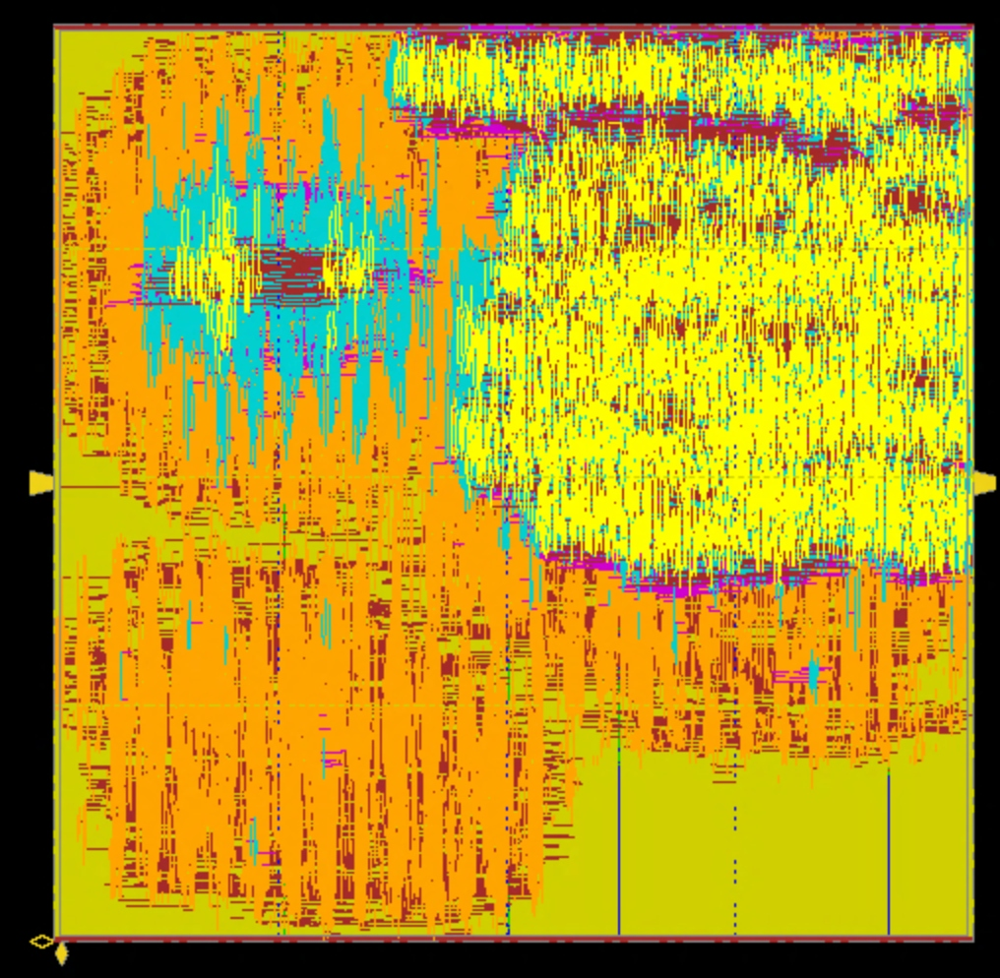

# MNIST 4-Layer NPU (16-bit Q12 TDM Architecture)

[](https://en.wikipedia.org/wiki/SystemVerilog)
[]()
[]()

This repository contains a 4-layer Neural Network Processor (NPU) implementation for MNIST digit classification, optimized for ASIC synthesis.

## Architecture Overview
- **Topology**: `784 (Input) -> 32 (Hidden) -> 16 (Hidden) -> 16 (Hidden) -> 10 (Output)`
- **Precision**: 16-bit Fixed-point (Q12) quantization.
- **Hardware Architecture**: **32-Lane Time-Multiplexed (TDM)** design with Resource Sharing.
- **Activation Function**: Hardware-friendly **ReLU**.
- **Performance**: 100% Bit-true match with C reference model.

## Key Implementation Details

### 1. Synthesis-Friendly Weight Initialization
Instead of `$readmemh`, we use a SystemVerilog package (`weight_pkg.sv`) containing parameters. This allows for:
- **Constant Propagation**: Cadence Genus can optimize weights into logic-based ROMs.
- **Register Merging**: Massive reduction in area by sharing common weight patterns.

### 2. Instruction & Usage
### 2. Instruction & Usage
- **Documentation & Reports**:
  - [**Final Project Report (PDF)**](final_report/CE499_Project_Report_Winter.pdf)
  - [**General Project Notes**](NOTES.md)
  - [**Innovus Design Log/Notes**](neural_net_4layer/hardware/backend/innovus/note.md)
- **Folder Navigation**:
  - [**RTL & Simulation**](neural_net_4layer/hardware/frontend/)
  - [**Synthesis (Genus)**](neural_net_4layer/hardware/backend/genus/)
  - [**Physical Design (Innovus)**](neural_net_4layer/hardware/backend/innovus/)

- **Weight Generation**: 
  ```bash
  python3 software/gen_npu_weights.py  # Generates weight_pkg.sv
  ```
- **Simulation (ModelSim)**:
  ```bash
  cd hardware/frontend/sim
  vsim -c -do nn_sim.do
  ```
- **Synthesis (Cadence Genus)**:
  ```bash
  cd hardware/backend/genus
  genus -files synthesis.tcl
  ```
- **Physical Design (Cadence Innovus)**:
  ```bash
  cd hardware/backend/innovus
  source /vol/ece303/genus_tutorial/cadence.env
  python3 add_pg_pins.py ../genus/nn_top_syn.v nn_top_syn_pg.v
  innovus -files run_innovus.tcl
  ```
- **Review Tape-out (Restore Design)**:
  ```bash
  cd hardware/backend/innovus
  innovus
  # Inside Innovus console:
  restoreDesign nn_top_final.enc.dat nn_top
  ```

## Performance Metrics

### 1. Synthesis Results (Baseline)
Synthesis results using **NangateOpenCellLibrary** (typical conditions):

| Metric | Result |
| :--- | :--- |
| **Total Area** | 678,599 µm² |
| **Cell Count** | 179,529 |
| **Clock Frequency** | 100 MHz (Target) |
| **Timing Slack** | +5,195 ps (MET) |
| **Total Power** | 86.6 mW |

### 2. Physical Design Results (Final APR)
Final **Post-Route** (Iteration 3) results after Place & Route in Innovus:

| Metric | Result |
| :--- | :--- |
| **Core Utilization** | 50.14% |
| **Power (Total)** | 69.27 mW |
| **WNS (Setup)** | +1.214 ns |
| **WNS (Hold)** | +0.458 ns |
| **DRC Violations** | **0 (Clean)** |
| **Routing Layers** | Metal 1 to Metal 9 |

### 3. Final Physical Layout


*Final Place & Route result from Cadence Innovus (Silicon Ready).*

## Current Progress: Gate-Level Simulation (GLS)
1. **Synthesis Netlist (Genus)**:
   - [x] **Functional & Delay Simulation**: **PASSED** (Both zero-delay and unit-delay modes).
2. **Physical Design Netlist (Innovus)**:
   - [x] **Post-Route Functional (notiming)**: **PASSED** (Matches C-Model 100%).
   - [ ] **Post-Route Timing (with SDF)**: **DEBUGGING** (Active work on SDF annotation and X-propagation).

## Hardware/Software Co-Verification
The RTL implementation achieves **10/10 (100%) accuracy** across MNIST test samples, perfectly matching the C-based reference model outputs.
